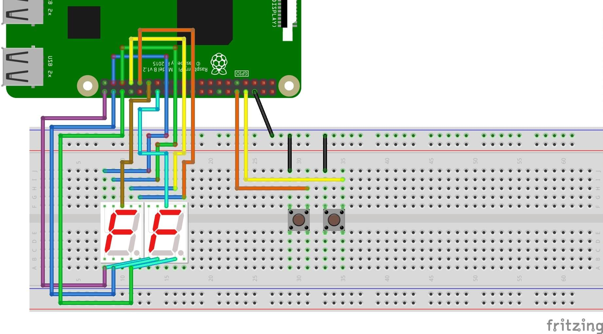

# Raspberry P0

[](https://landscape.io/github/PedalPi/Raspberry-P0/master) [](https://www.codacy.com/app/mateus-moura/Raspberry-P0?utm_source=github.com&amp;utm_medium=referral&amp;utm_content=PedalPi/Raspberry-P0&amp;utm_campaign=Badge_Grade)

A simple physical controller for change and view the current patch with 2 buttons and 7 segments displays

```
╔═══════════════════════════════════════════════╗
║                P e d a l   P i             P0 ║
║                 Current patch                 ║
║                   ┌ ⎯  ⎯  ┐                   ║
║                   |⎥⎯⎜⎥⎯⎜ |                   ║
║                   |⎥⎯⎜⎥⎯⎜.|                   ║
║                   └-------┘                   ║
║-----------------------┬-----------------------╢
║   - - - - - - - - -   |   - - - - - - - - -   ║
║   - - - - - - - - -   |   - - - - - - - - -   ║
║   - - - - - - - - -   |   - - - - - - - - -   ║
║   - - - - - - - - -   |   - - - - - - - - -   ║
╚═══════════════════════════════════════════════╝
```

## Elements list:

 - 2 displays 7 segments
 - 2 (foot) buttons for Patch change

## To install

View the [Application documentation](http://pedalpi-application.readthedocs.io/en/latest/?badge=latest#using) for more details how to add others components.

Below is a `config.py` example:

```python
import sys
from signal import pause

sys.path.append('application')
sys.path.append('physical')
sys.path.append('raspberry_p0')

from application.Application import Application
from raspberry_p0.raspberry_p0 import RaspberryP0

address = 'localhost'
port = 3000

application = Application(data_patch="data/", address=address, test=True)
application.register(RaspberryP0(application))

application.start()

pause()
```



### Dependencies

**Pedal Pi - Raspberry P0** requires `gpiozero >= 1.2.0` for access GPIO and [Physical project](http://github.com/PedalPi/Physical) for SevenSegments lib ([gpiozero not contains yet](https://github.com/RPi-Distro/python-gpiozero/issues/493)). 

### Changing pins

If necessary, you can create a `config.ini` file to change the default pinout:

* Access the config.ini pin;
* Copy it and save in your local preference; 
* Change the pinout numbers. It's necessary then you informs all;
* In your `start.py`, calls `RaspberryP0` with the file preference.
```python
application.register(RaspberryP0(application, 'my-conf.ini'))
```

## To test

Not implemented yet

## Example


