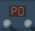
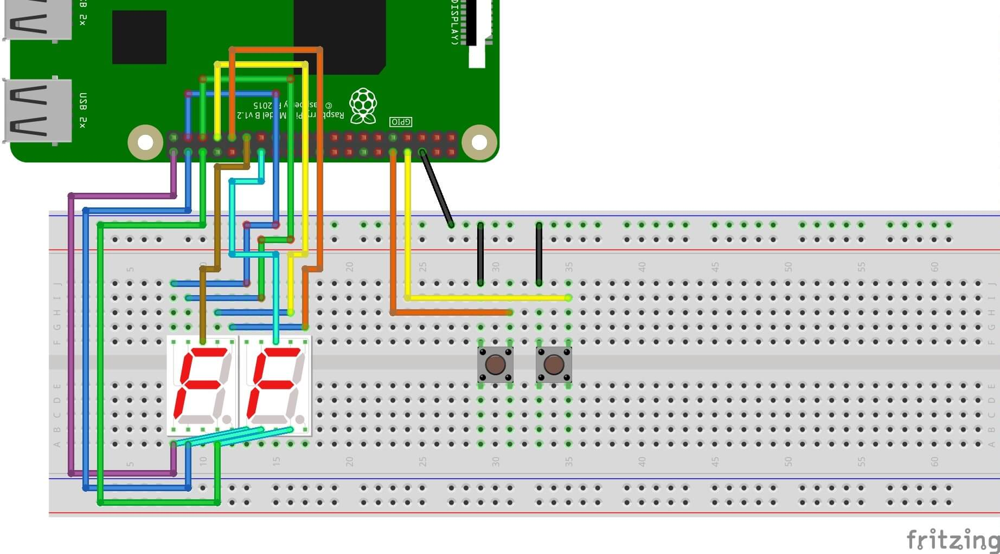
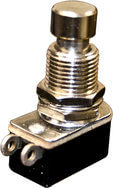
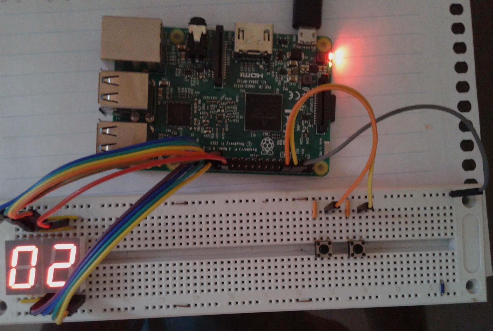
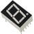
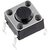

|Raspberry P0 symbol| Raspberry P0
==================================

|Build Status| |Code Health| |Codacy Badge|

A simple physical controller for change and view the current pedalboard
with 2 buttons and 7 two segments displays

::

    ╔═══════════════════════════════════════════╗
    ║              P e d a l   P i           P0 ║
    ║                 ┌ ⎯  ⎯  ┐                 ║
    ║                 |⎥⎯⎜⎥ ⎜ |                 ║
    ║                 |⎥  ⎥⎯⎜.|                 ║
    ║                 └-------┘                 ║
    ║---------------------┬---------------------╢
    ║ ..=.............=.. | .........=......... ║
    ║ ....=.........=.... | ......=.....=...... ║
    ║ ......=.....=...... | ....=.........=.... ║
    ║ .........=......... | ..=.............=.. ║
    ╚═══════════════════════════════════════════╝

**Documentation:**
   https://github.com/PedalPi/Raspberry-P0#raspberry-p0

**Code:**
   https://github.com/PedalPi/Raspberry-P0

**Python Package Index:**
   https://pypi.org/project/PedalPi-Raspberry-P0

**License:**
   `Apache License 2.0`_

.. _Apache License 2.0: https://github.com/PedalPi/Raspberry-P0/blob/master/LICENSE

Elements list:
--------------

-  |A seven segments displays component| 2 seven segments displays;
-  |A push button component| 2 push buttons for Pedalboard change.

Installation
------------

PedalPi components enable the extension of `Pedal Pi - Application`_.
Through them, opening services are offered. A list of components can be found in the `Components repository`_.

.. _Pedal Pi - Application: http://pedalpi-application.readthedocs.io/en/latest/
.. _Components repository: https://github.com/PedalPi/Components#list

Use the pip to install the *PedalPi-Raspberry-P0*

.. code-block:: bash

   pip3 install PedalPi-Raspberry-P0

Create the ``program.py``
~~~~~~~~~~~~~~~~~~~~~~~~~

The following example demonstrates a basic setup for the Pedal Pi -
Raspberry P0. If you want to add other components, check the `component
list <https://github.com/PedalPi/Components>`__.

.. code-block:: python

    import sys
    from signal import pause

    from application.application import Application
    from raspberry_p0.raspberry_p0 import RaspberryP0

    application = Application(path_data="data/", address='localhost')
    application.register(RaspberryP0(application))

    application.start()

    try:
        pause()
    except KeyboardInterrupt:
        application.stop()

Start
~~~~~

.. code-block:: bash

    python3 program.py

Schematic
---------

The following image shows the connections between components and Raspberry Pi
to the default configuration. If you wish to change the pins, refer to
`Configuration File <#configuration-file>`__.

Pins
~~~~

The pins of the seven-segment displays are shared with each other. That
is, the ``pin_a`` of display 1 is shorted with the\ ``pin_a`` of display
2, ``pin_b`` of display 1 is shorted with\ ``pin_b`` of display 2 and so
on. However, this rule does not apply to ``common_pin``, where each
display must have its own control pin.

The used pins are:

+-----------------------+------------+-------------+---------------------------------+
| Config identifier     | Pin¹       | Type        | Function                        |
+=======================+============+=============+=================================+
| pin\_a                | ``13``     | integer     | Seven segments - Pin A          |
+-----------------------+------------+-------------+---------------------------------+
| pin\_b                | ``6``      | integer     | Seven segments - Pin B          |
+-----------------------+------------+-------------+---------------------------------+
| pin\_c                | ``16``     | integer     | Seven segments - Pin C          |
+-----------------------+------------+-------------+---------------------------------+
| pin\_d                | ``20``     | integer     | Seven segments - Pin D          |
+-----------------------+------------+-------------+---------------------------------+
| pin\_e                | ``21``     | integer     | Seven segments - Pin E          |
+-----------------------+------------+-------------+---------------------------------+
| pin\_f                | ``19``     | integer     | Seven segments - Pin F          |
+-----------------------+------------+-------------+---------------------------------+
| pin\_g                | ``26``     | integer     | Seven segments - Pin G          |
+-----------------------+------------+-------------+---------------------------------+
| pin\_dp               | ``0``      | integer     | Seven segments - Dot point pin  |
+-----------------------+------------+-------------+---------------------------------+
| common\_pins          | ``[5, 1]`` | integer     | Seven segments - Common pins    |
|                       |            | list        |                                 |
+-----------------------+------------+-------------+---------------------------------+
| common\_anode         | ``True``   | bool        | ``True`` if the displays are    |
|                       |            |             | anode. ``False`` if are         |
|                       |            |             | cathode.                        |
+-----------------------+------------+-------------+---------------------------------+
| next\_pedalboard      | ``14``     | integer     | Button - Set to next Pedalboard |
+-----------------------+------------+-------------+---------------------------------+
| before\_pedalboard    | ``15``     | integer     | Button - Set to before          |
|                       |            |             | Pedalboard                      |
+-----------------------+------------+-------------+---------------------------------+
| momentary\_footswitch | ``False``  | bool        | ``True`` if buttons are         |
|                       |            |             | momentary. ``False`` if buttons |
|                       |            |             | are two state                   |
+-----------------------+------------+-------------+---------------------------------+

¹ `BCM pin numeration <https://pinout.xyz/>`__

.. _configuration-file:

Configuration file
------------------

It's possible changes the pins using a configuration file. The numbering
of the pins corresponds to **BCM**. Isn't necessary to inform all
configurations. An element not informed will be treated with your
default value.

A Raspberry Pi pinout schematic can be seen in
`pinout.xyz <https://pinout.xyz/>`__.

The **config\_file** has the following structure:

::

    [display]
    pin_a = 13
    pin_b = 6
    pin_c = 16
    pin_d = 20
    pin_e = 21
    pin_f = 19
    pin_g = 26
    pin_dp = 0

    common_pins = [5, 1]
    common_anode = True

    [pedalboard]
    next_pedalboard = 14
    before_pedalboard = 15

    momentary_footswitch = True

    [test]
    test = False

For P0 to loads the new configuration, references the file in
``RaspberryP0`` constructor.

.. code-block:: python

    # The config file has named as 'path/my_awersome_config.ini'.
    application.register(RaspberryP0(application, configuration_file='my_awersome_config.ini'))

|A seven segments displays component| ``[display]`` Seven segments display
~~~~~~~~~~~~~~~~~~~~~~~~~~~~~~~~~~~~~~~~~~~~~~~~~~~~~~~~~~~~~~~~~~~~~~~~~~

The seven-segment display consists of eight pins corresponding to the
leds (``pin_a`` to\ ``pin_g`` and ``pin_dp``) and two common pins (which
are short-circuited).

There are two types of seven-segment displays: Cathode and Anode.
``common_anode`` informs if the displays are Anode or Cathode.

The image obtained from `Circuits
Today <http://www.circuitstoday.com/arduino-and-7-segment-display>`__
illustrates the correspondence of the pins with the LEDs.

Led pins
^^^^^^^^

To save the amount of pins required for the project, the pins of the
seven-segment displays are shared with each other. In this way, the pins
corresponding to the pins leds (``pin_a`` to\ ``pin_g`` and ``pin_dp``)
must respectively be short-circuited to the displays. That is, the
``pin_a`` of display 1 is short-circuited with the\ ``pin_a`` of display
2, ``pin_b`` of display 1 is short-circuited with\ ``pin_b`` of display
2 and so on.

+---------------------+-----------------+-----------+-----------------+
| Config identifier   | Default value   | Type      | Function        |
+=====================+=================+===========+=================+
| ``pin_a``           | ``13``          | integer   | Pin A           |
+---------------------+-----------------+-----------+-----------------+
| ``pin_b``           | ``6``           | integer   | Pin B           |
+---------------------+-----------------+-----------+-----------------+
| ``pin_c``           | ``16``          | integer   | Pin C           |
+---------------------+-----------------+-----------+-----------------+
| ``pin_d``           | ``20``          | integer   | Pin D           |
+---------------------+-----------------+-----------+-----------------+
| ``pin_e``           | ``21``          | integer   | Pin E           |
+---------------------+-----------------+-----------+-----------------+
| ``pin_f``           | ``19``          | integer   | Pin F           |
+---------------------+-----------------+-----------+-----------------+
| ``pin_g``           | ``26``          | integer   | Pin G           |
+---------------------+-----------------+-----------+-----------------+
| ``pin_dp``          | ``0``           | integer   | Dot point pin   |
+---------------------+-----------------+-----------+-----------------+

Common pins
^^^^^^^^^^^

To describe the ``common_pin`` of the displays, a list of integers is
used, where the significance of the digits follows the ascending order:
the *tens* corresponds to the first element of the list and the *units*
to the second element of the list.

+---------------------+-------------+------------+--------------------------------+
| Config identifier   | Default     | Type       | Function                       |
|                     | value       |            |                                |
+=====================+=============+============+================================+
| ``common_pins``     | ``[5, 1]``  | integer    | Pin that controls the display  |
|                     |             | list       | view                           |
+---------------------+-------------+------------+--------------------------------+
| ``common_anode``    | ``True``    | bool       | ``True`` if the displays are   |
|                     |             |            | anode. ``False`` if are        |
|                     |             |            | cathode.                       |
+---------------------+-------------+------------+--------------------------------+

In `Quora there is a
tutorial <Https://www.quora.com/How-can-I-check-cathode-and-anode-in-seven-segment-display>`__
on how you can identify if a display is cathode or anode.

|A push button component| ``[pedalboard]`` Push buttons
~~~~~~~~~~~~~~~~~~~~~~~~~~~~~~~~~~~~~~~~~~~~~~~~~~~~~~~

Simple push buttons were used to change the current pedalboard. For use
with foot, is recommended use footswitches (like the temporary
footswitch in image below). The two types of buttons the system
supports are temporary buttons and two-state buttons (on-off).

+-----------------------+-------------+---------+-------------------------------------+
| Config identifier     | Default     | Type    | Function                            |
|                       | value       |         |                                     |
+=======================+=============+=========+=====================================+
| next\_pedalboard      | ``14``      | integer | Set the current pedalboard for the  |
|                       |             |         | next                                |
+-----------------------+-------------+---------+-------------------------------------+
| before\_pedalboard    | ``15``      | integer | Set the current pedalboard for the  |
|                       |             |         | before                              |
+-----------------------+-------------+---------+-------------------------------------+
| momentary\_footswitch | ``False``   | bool    | ``True`` if buttons are momentary.  |
|                       |             |         | ``False`` if buttons are two state  |
+-----------------------+-------------+---------+-------------------------------------+

``[test]`` Test
~~~~~~~~~~~~~~~

+---------------------+-----------------+--------+------------------------------------------+
| Config identifier   | Default value   | Type   | Function                                 |
+=====================+=================+========+==========================================+
| ``test``            | ``False``       | bool   | Disable GPIOZero for development tests   |
+---------------------+-----------------+--------+------------------------------------------+

Common questions
----------------

See `FAQs on the wiki <https://github.com/PedalPi/Raspberry-P0/wiki>`__.

Examples
--------

.. |Build Status| image:: https://travis-ci.org/PedalPi/Raspberry-P0.svg?branch=master
   :target: https://travis-ci.org/PedalPi/Raspberry-P0
.. |Code Health| image:: https://landscape.io/github/PedalPi/Raspberry-P0/master/landscape.svg?style=flat-square
   :target: https://landscape.io/github/PedalPi/Raspberry-P0/master
.. |Codacy Badge| image:: https://api.codacy.com/project/badge/Grade/f3e1af57f11d4d9e8be097153ce68195
   :target: https://www.codacy.com/app/mateus-moura/Raspberry-P0?utm_source=github.com&utm_medium=referral&utm_content=PedalPi/Raspberry-P0&utm_campaign=Badge_Grade

